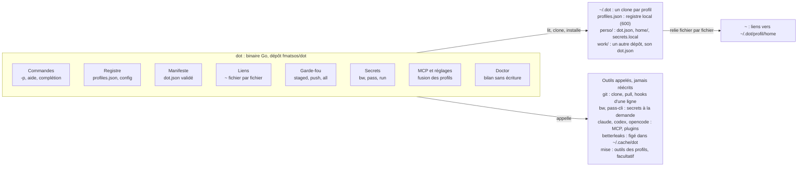
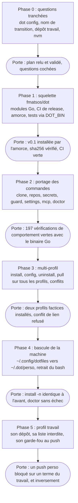

# Plan dot v2 — Go et multi-profils

État : phases 1 à 3 implémentées (voir l'avancement en fin de document) ; phases 4 et 5 à faire.

## Contexte et objectifs

dot v2 sort le CLI des dotfiles dans un dépôt dédié `fmatsos/dot`, réécrit en Go, capable de gérer un ou plusieurs profils, chacun porté par son propre dépôt de données.

Point de départ (6 octobre 2026) :

- `dot` est un CLI bash d'environ 1 000 lignes (plus 100 lignes d'awk) dans le dépôt `fmatsos/dotfiles`, couvert par 14 scripts de tests boîte noire (233 vérifications).
- L'étape 1 est livrée (commit `e876d53`) : toutes les valeurs propres au dépôt vivent dans un manifeste `dot.json`, plus aucune dans le code.
- Le moteur et les données partagent encore le même dépôt, et un seul profil existe.

Objectifs de la v2 :

1. **Un moteur public et agnostique** : aucune valeur personnelle ni professionnelle dans `fmatsos/dot`.
2. **Plusieurs profils** : un dépôt de données par profil (perso, travail…), installés côte à côte sur une même machine.
3. **Un binaire autonome** : `dot` s'installe et tourne sans mise, sans bash 4.4, sur Linux et macOS.
4. **Aucune régression** : les comportements actuels (liens, garde-fou, secrets, MCP, doctor) restent identiques, prouvés par les tests existants.

## Décisions prises

Dix décisions sont acquises ; elles ne se rediscutent pas pendant l'implémentation.

| Sujet | Décision |
| --- | --- |
| Langage | Go, binaire statique par plateforme |
| Bibliothèque CLI | cobra : aide et complétion zsh générées, une dépendance assumée |
| Dépôt | `fmatsos/dot`, public, sans aucune valeur propre à un utilisateur |
| Emplacement des profils | `~/.dot/<clé>`, un clone par profil |
| Registre | `~/.dot/profiles.json`, propre à la machine, créé par `dot install`, modifié par `dot config` |
| Ciblage | `-p/--profile <clé>`, puis `DOT_PROFILE`, puis le profil par défaut du registre |
| Portée sans `-p` | `pull` et `doctor` agissent sur tous les profils ; les autres commandes sur le profil par défaut |
| Conflit de liens | deux profils qui lient le même fichier dans `~` : installation refusée |
| `install.sh` | conservé comme amorce minimale pour une machine neuve |
| `dot profile` | garde son nom et son rôle : règles d'identité git `includeIf` |

mise reste le gestionnaire d'outils (node, CLI figées), déclaré dans les données, mais `dot` lui-même n'en dépend plus. Les clés de profil qui nomment un employeur n'apparaissent que dans le registre local et dans le dépôt de ce profil.

## Architecture du dépôt fmatsos/dot

Un seul binaire Go porte toute la logique ; les profils ne contiennent que des données, et les outils existants sont appelés, jamais réécrits.

*Un binaire autonome orchestre les profils et les outils existants.*



Chaque paquet tient dans `internal/<nom>` et ne dépend que du manifeste et du registre ; les commandes vivent dans `cmd/dot`.

```text
fmatsos/dot/
├── cmd/dot/            point d'entrée, options globales (-p, --version)
├── internal/registry/  profiles.json : lecture, écriture atomique, validation
├── internal/manifest/  dot.json : structs, clés inconnues refusées
├── internal/link/      liens, sauvegardes, purge, conflits entre profils
├── internal/guard/     garde-fou, betterleaks figé
├── internal/secrets/   bw, pass-cli, run
├── internal/mcp/       fusion et rendu Claude, Codex, OpenCode
├── tests/              les scripts bash actuels, contrat boîte noire
└── install.sh          amorce minimale
```

**Extensions** : comme aujourd'hui, `dot <cmd>` lance un exécutable `dot-<cmd>` trouvé dans le `bin/` d'un profil ou dans le `PATH` ; un nom revendiqué par deux profils est refusé.

## Modèle des profils

Un profil est un dépôt de données cloné dans `~/.dot/<clé>` ; le registre ne retient que sa clé et son URL, le chemin s'en déduit.

```text
~/.dot/
├── profiles.json      registre local (600), jamais versionné
├── perso/             clone : dot.json, home/, bin/, secrets.local, forbidden.local
└── work/              clone d'un autre dépôt, avec son propre dot.json
```

```json
{ "default": "perso",
  "profiles": {
    "perso": { "repo": "https://github.com/<utilisateur>/dotfiles.git" },
    "work":  { "repo": "<dépôt privé>" } } }
```

**Le `dot.json` de chaque profil** garde le schéma de l'étape 1, sans `deploy.path` (le chemin vient du registre) : dossiers du clone partiel, profils git et profil d'identité du clone, marketplace et plugins, paquets nvm, modules lancés après installation.

**Commandes du registre**

| Commande | Effet |
| --- | --- |
| `dot install <url> [-p <clé>]` | clone dans `~/.dot/<clé>`, inscrit au registre (créé au besoin ; le premier profil devient le défaut), installe |
| `dot install` | réinstalle tous les profils inscrits |
| `dot uninstall -p <clé>` | retire les liens du profil, puis son entrée ; le clone est gardé sauf `--purge` |
| `dot config list` | affiche le registre |
| `dot config get <clé>` | lit une valeur (`default`, `profiles.work.repo`) |
| `dot config set <clé> <valeur>` | écrit une valeur validée, de façon atomique |
| `dot config unset <clé>` | retire une valeur ; refuse un profil encore installé |

**Composition entre profils** : jamais par écrasement de fichiers, toujours par les mécanismes d'inclusion existants.

- Git : chaque profil apporte ses `profiles/<nom>.gitconfig` et ses règles `includeIf`, inclus depuis `~/.gitconfig`.
- MCP : `dot mcp` fusionne les `servers.json` de tous les profils, dans l'ordre du registre, puis `servers.local.json`.
- Réglages Claude : `dot settings` fusionne les `settings.base.json` de tous les profils dans le même ordre.
- Liens : un fichier revendiqué par deux profils bloque `dot install`, avec les deux chemins dans le message.

## Distribution et amorce

`dot` s'installe depuis une release GitHub vérifiée par sha256, sans mise ni `curl | sh` ; mise reste installé ensuite par les données, pour les autres outils.

**Releases** (CI du dépôt `fmatsos/dot`, sur tag `vX.Y.Z`) :

- binaires statiques `linux-x64`, `linux-arm64`, `macos-x64`, `macos-arm64` (`CGO_ENABLED=0`) ;
- un fichier `SHA256SUMS` publié avec la release ;
- la version est inscrite dans le binaire (`dot --version`).

**Amorce `install.sh`** (une trentaine de lignes, versionnée dans `fmatsos/dot`) :

1. détecter la plateforme ;
2. télécharger la release figée dans le script et la vérifier contre la somme écrite dans le script ;
3. l'installer dans `~/.local/bin/dot` ;
4. lancer `dot install <url du premier profil>`.

Une nouvelle version de `dot` se publie en changeant la version et la somme dans l'amorce, puis `dot self-update` (même téléchargement vérifié) sur les machines.

**Outils annexes** : `dot guard` télécharge lui-même la version figée de betterleaks (sha256 compilé dans le binaire) dans `~/.cache/dot/`, ce qui rend le garde-fou indépendant du `PATH` des clients git graphiques. Ensuite, `dot install` installe mise (version et sha256 figés, comme aujourd'hui) seulement si un profil déclare un `config.toml`.

## Garde-fou et secrets

Le garde-fou passe dans le binaire (`dot guard`) avec les mêmes règles qu'aujourd'hui ; chaque profil apporte sa propre liste de termes interdits.

**`dot guard staged | msg <fichier> | push | all`**

- Les hooks des dépôts deviennent des appels d'une ligne : `exec dot guard staged`.
- Il échoue fermé : liste absente, vide ou invalide, commande git en échec, scanner indisponible, tout bloque.
- Il ne rapporte que des noms de fichiers ou des commits, jamais le texte trouvé.
- Les noms de fichiers sont lus séparés par NUL, sans guillemets git.
- betterleaks tourne avec `--redact`, depuis la copie figée de `~/.cache/dot/`.

**Quelle liste pour quel dépôt** : le hook `pre-push` global lit `dotfiles.profile` du dépôt poussé et applique `~/.dot/<ce profil>/forbidden.local`. Un dépôt perso est donc contrôlé contre les termes du travail, un dépôt de travail contre ses propres termes. `dotfiles.guard secrets` (betterleaks seul) est conservé pour les dépôts qui citent un employeur volontairement.

**Secrets (`dot secrets`)** : comportement inchangé.

- Chaque profil a son `secrets.local` (`NOM=bw:<élément>` ou `NOM=pass:<coffre>/<élément>`).
- Les valeurs ne passent jamais en argument de processus : environnement limité à une commande, ou stdin.
- `run` résout toutes les valeurs avant de lancer la commande, puis remplace le processus par elle (`syscall.Exec`).
- Session Bitwarden : `BW_SESSION` ou le cache `bw-session.local` (600).
- Les tests utilisent des CLI factices placés en tête de `PATH`.

## Stratégie de migration

Les 14 scripts de tests bash restent le contrat : le binaire Go doit les faire passer tels quels, commande par commande, avant toute suppression de bash.

**Le contrat** : 197 des 233 vérifications actuelles testent un comportement (secrets, garde-fou, doctor, MCP, repos, clone, hooks, réglages, purge) et restent valables pour le binaire Go. Elles demandent une seule adaptation mécanique : elles lancent aujourd'hui `bash "$root/bin/dot-…"`, elles passeront par `"$DOT_BIN" <cmd>`, qui choisit l'implémentation testée. Les messages en français font partie du contrat.

Les 36 autres testent l'implémentation bash : elles sont remplacées, pas portées, et ce travail est compté dans les phases 1 et 2.

| Tests actuels | Vérifications | Devenir |
| --- | --- | --- |
| `help.sh` | 12 | aide générée par cobra : quelques tests de sortie de `dot --help` ; le test de `dot terms` est gardé |
| `completion.sh` | 8 | complétion générée par cobra : nouveaux tests sur `dot __complete` |
| `manifest.sh` | 10 | validation de `dot.json` : mêmes cas, en tests unitaires Go (`internal/manifest`) |
| `install.sh` | 6 | l'amorce change : un test de bout en bout de l'amorce puis de `dot install` |
| `prompt.sh` | 1 | bloc shellkit, hors de `dot` : reste dans le dépôt de données |

**Ordre de portage** (du plus isolé au plus central) :

1. `clone`, `repos`, `profile`, `whoami`
2. `secrets`
3. `guard` (et hooks en une ligne)
4. `settings`, `mcp`
5. `doctor`
6. `install`, `pull`, `config`, `uninstall` et le multi-profil, qui n'existent qu'en Go

**Pendant la transition**, le dépôt `fmatsos/dotfiles` garde son `bin/` bash ; le binaire Go s'installe à côté sous un autre nom (`dot2`) jusqu'à la bascule.

**Bascule de la machine** (une fois, par `dot install` en Go) :

1. déplacer `~/.config/dotfiles` vers `~/.dot/perso`, avec ses fichiers locaux (`secrets.local`, `forbidden.local`, `bw-session.local`) ;
2. créer le registre avec `perso` par défaut ;
3. refaire tous les liens de `~` vers le nouveau chemin (les anciens liens sont remplacés sans sauvegarde puisqu'ils pointaient vers le clone) ;
4. retirer `bin/`, `.githooks/guard` et `install.sh` du dépôt de données, qui ne garde que `dot.json`, `home/` et ses hooks d'une ligne ;
5. mettre à jour le README, `CLAUDE.md`, le bloc shellkit et la mémoire, qui citent `~/.config/dotfiles`.

## Phasage

Six phases, chacune livrée et vérifiée avant la suivante ; aucune date n'est fixée, l'ordre seul compte.

*Six phases, chacune close par un critère vérifiable.*



Chaque phase passe par le cycle déjà rodé : consigne numérotée à Codex, revue point par point, tests relancés, puis livraison. La phase 4 est la seule à toucher la machine réelle ; elle se fait à blanc d'abord, comparée à l'état d'avant.

## Risques et questions ouvertes

**Risques**

| Risque | Parade |
| --- | --- |
| Deux implémentations divergent pendant la transition | les mêmes tests boîte noire pour les deux ; on ne corrige plus le bash qu'en cas de faille |
| Une fuite pendant la bascule (fichiers locaux copiés, chemins mal résolus) | déplacement et non copie, test à blanc (`-n`) comparé à l'état d'avant, comme pour l'étape 1 |
| Le garde-fou s'ouvre par erreur pendant le portage | ses tests (liste invalide, noms accentués, scanner absent) passent avant que les hooks n'appellent la version Go |
| Dépendances Go et chaîne d'approvisionnement | bibliothèque standard en priorité ; chaque dépendance justifiée et figée dans `go.sum` |
| Release cassée déployée partout | l'amorce et `self-update` figent une version ; revenir en arrière = réinstaller la version précédente |

**Questions à trancher avant le code**

- [x] Bibliothèque CLI : tranché, cobra (voir Décisions prises).
- [ ] `dot config` masque aujourd'hui `git config` transmis au clone : accepté, avec `git -C ~/.dot/<clé>` comme contournement ?
- [ ] Nom de transition du binaire Go (`dot2`) ou remplacement direct dès la première commande portée ?
- [ ] Le profil travail : son dépôt existe-t-il déjà, et sur quel hébergement ?
- [ ] Suppression de nvm : objectif séparé, ou inclus dans la bascule ?

## Avancement

- Phases 1 à 3 : faites. Tous les tests bash portés (`tests/*.sh`) et les tests Go passent.
- Questions de la phase 0 : le code a avancé avec ces hypothèses, à confirmer.
  - `dot config` masque `git config` transmis au clone : accepté, `git -C ~/.dot/<clé>` en contournement.
  - Nom de transition : le binaire se construit sous le nom `dot` ; installer l'exécutable sous `dot2` relève de la phase 4, pas du code.
  - Dépôt du profil travail et suppression de nvm : non traités ici (phases 4 et 5).
- Écarts assumés par rapport au bash : le garde-fou et les secrets n'ont plus besoin de `jq` ; l'aide est générée par cobra (plus de `help.awk`) ; les erreurs d'usage sortent en code 2 ; les termes interdits sont des regex RE2 insensibles à la casse (les extensions POSIX/GNU comme les rétro-références sont refusées, en échec fermé).
- À faire : figer les sommes betterleaks, écrire l'amorce `install.sh`, `dot self-update`, refus d'un nom `dot-<cmd>` revendiqué par deux profils, bascule de la machine.
